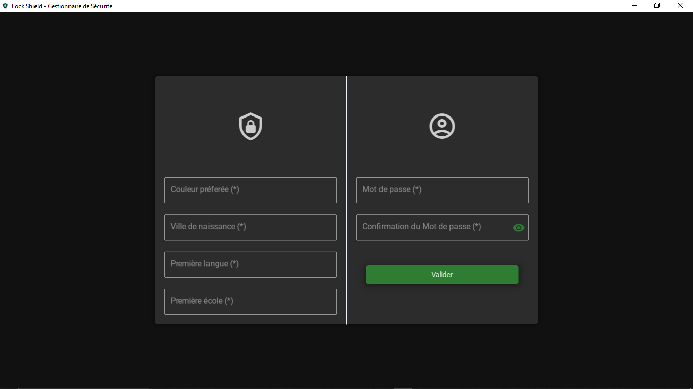
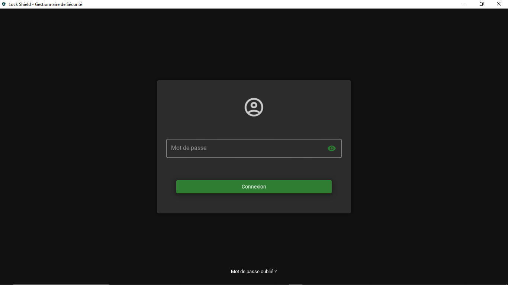
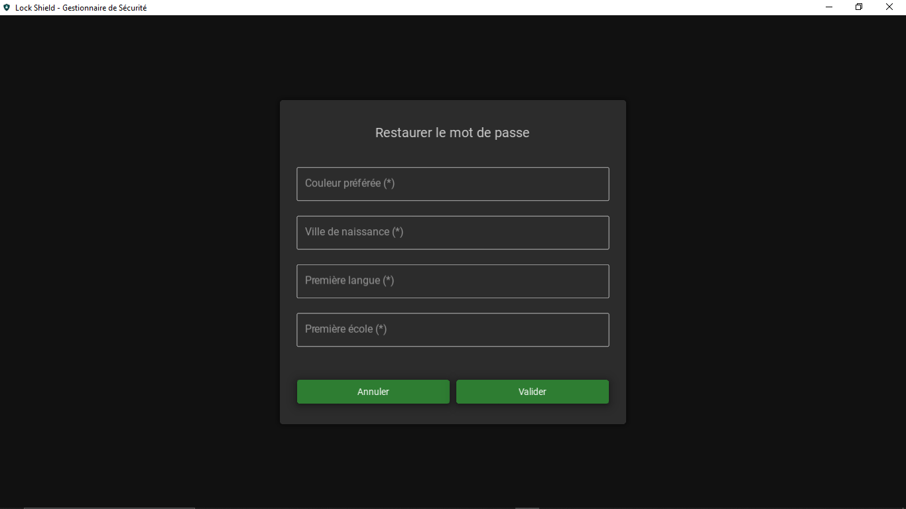
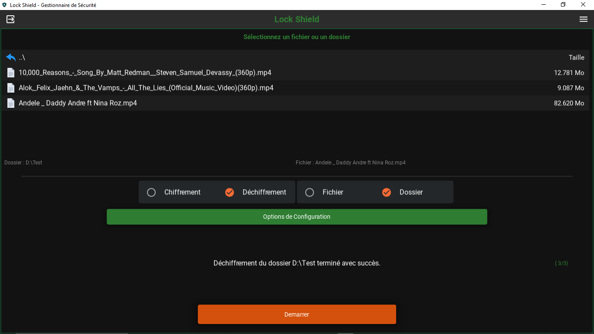
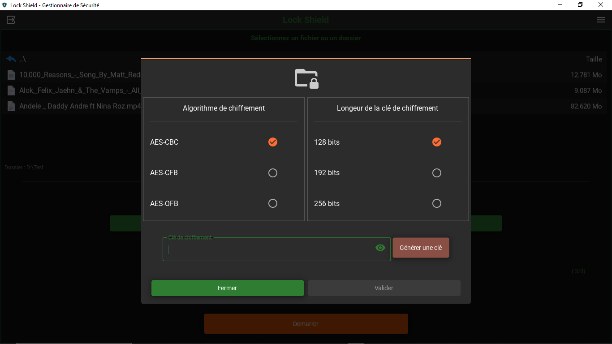
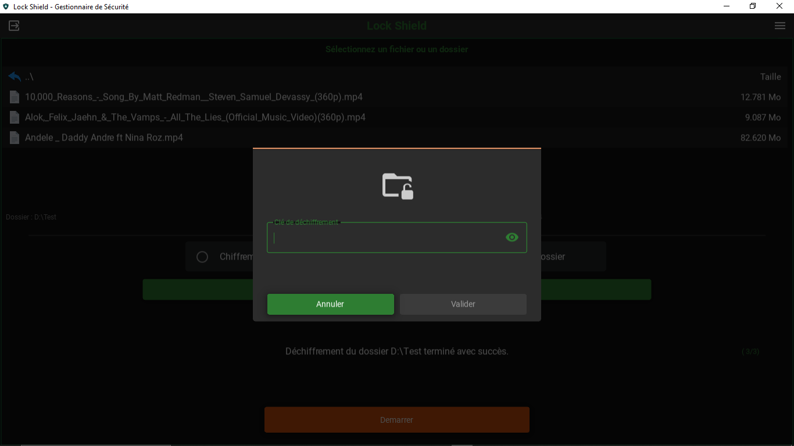
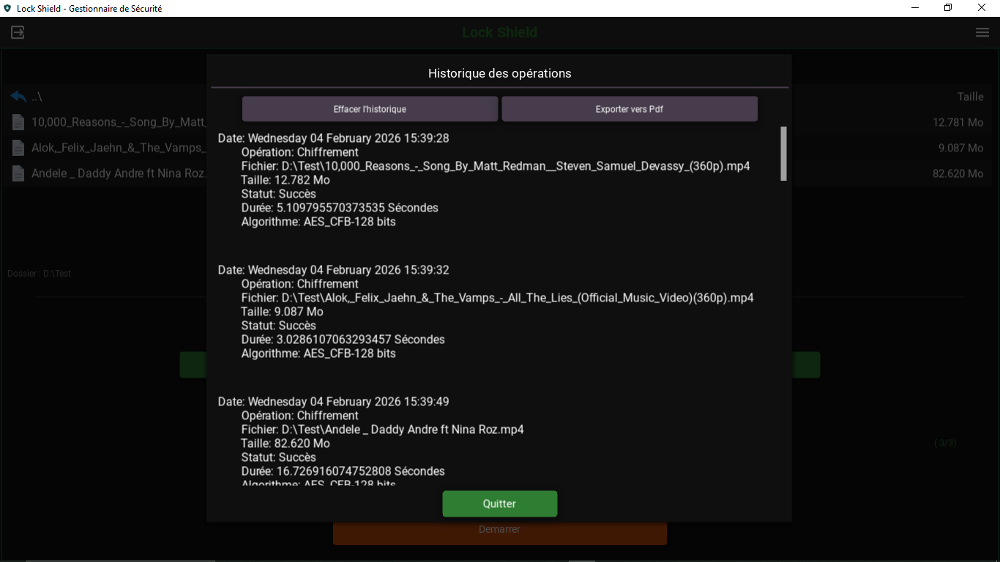
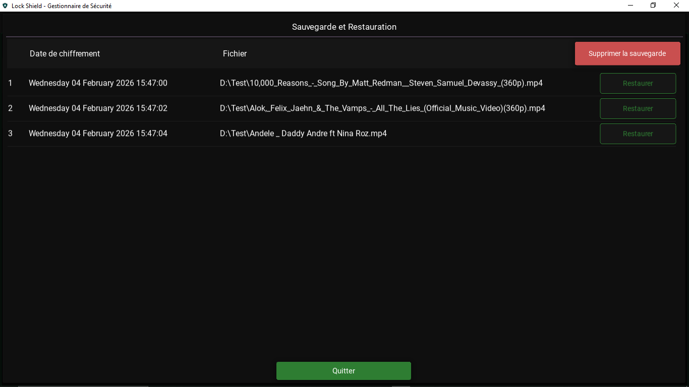
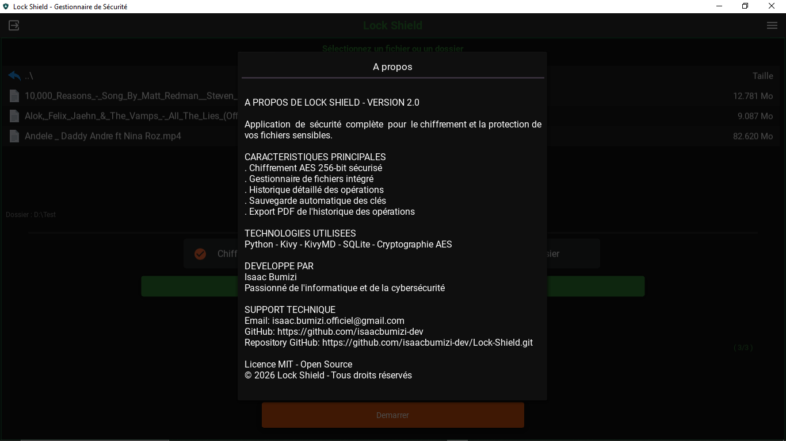

# Lock Shield - Application de Sécurité et Chiffrement de Fichiers


**Lock Shield** est une application de chiffrement et déchiffrement de données (fichiers) présente sur un ordinateur, conçue avec une interface moderne, cet outil est facile à prendre en main.

- Developeur: Isaac Bumizi
- Version: 2.0

## Fonctionnalités
### Chiffrement Avancé
- Algorithmes supportés: AES-CBC, AES-CFB, AES-OFB
- Tailles de clé: 128, 191 et 256 bits
- Chiffrement par fichiers ou dossier entiers
- Support des fichiers volumineux avec un chunks de 10 Mo lors de la lecture des fichiers

### Déchiffrement Intelligenet
- Détection automatique de l'algorithme utilisé lors du chiffrement
- Gestion des erreurs de clé invalide
- Restauration des clés perdues via un système de backup

### Système d'Authentification Sécurisé
- Authentification par mot de passe maître
- Hachage avec bcrypt
- Questions de sécurité pour une récupération
- Configuration utilisateur personnalisée

### Gestion Complète
- Historique détaillé des opérations
- Sauvegarde automatique des clés de chiffrement
- Export PDF de l'historique
- Interface moderne avec KivyMD Materials Design

### Interface Utilisateur
- Interface responsive adaptée à tous les écrans
- Navigation intuitive entre écrans
- Gestionnaire de fichiers intégré
- Indicateurs de progression en temps réel

### Captures d'écran












## Installation
### Prérequis
- Python 3.10 ou supérieur
- pip (gestionnaire de paquets Python)
- Git (optionnel, pour cloner le dépôt)

### Méthode 1: Installation Standard

- Cloner le dépôt avec 
```bash
git clone clone https://github.com/isaacbumizi-dev/lock-shield.git
cd lock-shield/Version_2.0
```
- Créer un environnement virtuel (recommandé)
```bash
# Windows
python -m venv venv
venv\Scripts\activate

# Linux/Mac
python3 -m venv venv
source venv/bin/activate
```
- Installer les dépendances
```bash
pip install -r requirements.txt
```
- Lancer l'application
```bash
python main.py
```

### Méthode 2: Installation Rapide
```bash
# En une seule commande
git clone clone https://github.com/isaacbumizi-dev/lock-shield.git && cd lock-shield/Version_2.0 && pip install -r requirements.txt && python main.py
```

## Utilisation
Première utilisateur
1. Lancer l'application
2. Configurer votre profil:
   - Définir un mot de passe maître
   - Répondre aux questions de sécurité
   - Confirmer votre configuration
3. Authentification:
   - Utiliser votre mot de passe maître
   - Accéder à l'interface principal
   
Chiffrer un Fichier
1. Sélectioner "Chiffrement"
2. Choisir 'Fichier' comme cible
3. Sélectionner le fichier via le gestionnaire
4. Configurer les paramètres:
    - Algorithme (AES-CBC/CFB/OFB)
    - Taille de clé (128/192/256 bits)
    - Générer ou saisir une clé
5. Cliquer sur "Lancer"

Chiffrer un Dossier
1. Sélectionner "Chiffrement"
2. Choisir "Dossier" comme cible
3. Sélectionner le dossier
4. Configurer les paramètres
5. Cliquer sur "Lancer" (Tous les fichiers du dossier et des sous-dossiers seront chiffrés)


Déchiffrer
1. Sélectionner "Déchiffrement"
2. Choisir la cible (fichier ou dossier)
3. Saisir la clé de déchiffrement
4. Cliquer sur 'Lancer'

Gestion des clés
- Historique: Consulter toutes les opérations
- Sauvegarde: Clés automatique sauvegardées
- Restauration: Récuperer une clé perdue via authentification

Exportation
- Historique: Exporter au format PDF
- Clés: Copier dans le presse-papier

## Architecture

### Stack Technologique
```
Frontend: Kivy + KivyMD (python)
Backend: Python 3.10+
Base de données: SQLite3
Cryptographie: PyCryptodome + Cryptography
UI/UX: Material Design
```

### Composants Principaux
1. Inteface Graphique (GUI)
   - main.py: Point d'entrée et configuration
   - screenManager.py: Gestion de la navigation
   - fileChooser.py: Gestionnaire de fichiers personnalisé
2. Sécurité
   - cryptoEngine.py: Moteur de chiffrement/Déchiffrement
   - validators.py: Validation et hachage des mots de passe
   - database.py: Gestion sécurisée des données
3. Ecrans d'Application
   - authentication.py : Authentification utilisateur 
   - userConfiguration.py : Configuration initiale 
   - cryptoWindow.py : Interface de chiffrement 
   - history.py : Historique des opérations 
   - restoration.py : Gestion des sauvegardes 
   - passwordRestoration.py : Récupération de mot de passe

## Sécurité
Mesures de Sécurité Implémentées
1. Protection des Mots de Passe 
    - Hachage avec bcrypt (coût adaptatif) 
    - Dérivation de clé PBKDF2 avec 100 000 itérations

2. Chiffrement des Fichiers
    - Algorithmes AES éprouvés 
    - Modes sécurisés (CBC, CFB, OFB)
    - IV aléatoires pour chaque opération 
    - Signature d'algorithme pour vérification
    - 
3. Protection des Données
    - Base de données SQLite 
    - Sauvegarde sécurisée des clés 
    - Historique protégé

4. Sécurité de l'Application
   - Validation des entrées utilisateur 
   - Gestion sécurisée des erreurs 
   - Protection contre les attaques par force brute

## Structure du Projet
```
lock-shield/
│
├── main.py                          # Point d'entrée principal
├── requirements.txt                 # Dépendances Python
├── README.md                        # Documentation
│
├── core/                            # Logique métier
│   ├── crypto/
│   │   └── cryptoEngine.py          # Moteur de chiffrement
│   ├── database/
│   │   └── database.py              # Gestion base de données
│   └── utils/
│       └── validators.py            # Validation et sécurité
│
├── gui/                             # Interface graphique
│   ├── components/                  # Composants réutilisables
│   │   ├── spinner.py               # Indicateur de chargement
│   │   ├── screenManager.py         # Gestionnaire d'écrans
│   │   └── fileChooser.py           # Sélecteur de fichiers
│   │
│   ├── screens/                     # Écrans de l'application
│   │   ├── authentication.py        # Authentification
│   │   ├── userConfiguration.py     # Configuration utilisateur
│   │   ├── passwordRestoration.py   # Récupération mot de passe
│   │   ├── cryptoWindow.py          # Chiffrement/déchiffrement
│   │   ├── history.py               # Historique
│   │   └── restoration.py           # Restauration des clés
│   │
│   └── style/                       # Fichiers de style Kivy
│       ├── userconfiguration.kv
│       ├── authentication.kv
│       ├── passwordrestoration.kv
│       ├── cryptowindow.kv
│       ├── history.kv
│       └── restoration.kv
│
├── assets/                          # Ressources
│   ├── images/                      # Images et icônes
│
├── data/                            # Données utilisateur (généré)
    └── .slt3_lite_sqli.sqlite      # Base de données

```

## Contribution

Les contributions sont les bienvenues ! Voici comment contribuer

Processus de Contribution
1. Fork le projet
2. Clone votre fork
```bash
git clone clone https://github.com/isaacbumizi-dev/lock-shield.git
```

3. Créez une branche pour votre fonctionnalité
```bash
git checkout -b feature/ma-nouvelle-fonctionnalite
```

4. Commitez vos changements
```bash
git commit -m "Ajout d'une nouvelle fonctionnalité"
```

5. Pushez vers votre branche
```bash
git push origin feature/ma-nouvelle-fonctionnalite
```

6. Ouvrez une Pull Request
   - Normes de Code 
   - Suivre le style PEP 8 
   - Documenter les nouvelles fonctions 
   - Ajouter des tests pour les nouvelles fonctionnalités 
   - Vérifier que tout fonctionne avant de soumettre

Améliorations Possibles 
    - Support multi-utilisateurs 
    - Chiffrement cloud 
    - Synchronisation des clés 
    - Interface web 
    - Applications mobiles 
    - Intégration avec services cloud

## Licence

Ce projet est sous licence MIT.

```
MIT License

Copyright (c) 2026 [Isaac Bumizi]

Permission is hereby granted, free of charge, to any person obtaining a copy
of this software and associated documentation files (the "Software"), to deal
in the Software without restriction, including without limitation the rights
to use, copy, modify, merge, publish, distribute, sublicense, and/or sell
copies of the Software, and to permit persons to whom the Software is
furnished to do so, subject to the following conditions:

The above copyright notice and this permission notice shall be included in all
copies or substantial portions of the Software.

THE SOFTWARE IS PROVIDED "AS IS", WITHOUT WARRANTY OF ANY KIND, EXPRESS OR
IMPLIED, INCLUDING BUT NOT LIMITED TO THE WARRANTIES OF MERCHANTABILITY,
FITNESS FOR A PARTICULAR PURPOSE AND NONINFRINGEMENT. IN NO EVENT SHALL THE
AUTHORS OR COPYRIGHT HOLDERS BE LIABLE FOR ANY CLAIM, DAMAGES OR OTHER
LIABILITY, WHETHER IN AN ACTION OF CONTRACT, TORT OR OTHERWISE, ARISING FROM,
OUT OF OR IN CONNECTION WITH THE SOFTWARE OR THE USE OR OTHER DEALINGS IN THE
SOFTWARE.
```

## Auteur

Isaac Bumizi
- Email: isaac.bumizi.officiel@gmail.com
- Github: https://github.com/isaacbumizi-dev


Remerciements
- L'équipe Kivy/KivyMD pour l'excellente bibliothèque GUI 
- La communauté Python pour le support continu 
- Tous les contributeurs qui ont aidé à améliorer ce projet


<div align="center">
⭐ N'hésitez pas à donner une étoile au projet si vous le trouvez utile !

Lock Shield - Protégez vos fichiers avec confiance 🔐
</div>

# Dépannage

Problèmes Courants

1. ImportError: No module named 'kivy'

```bash
pip install kivy kivymd
```

2. Erreur de chiffrement
- Vérifier que le fichier n'est pas déjà chiffré 
- S'assurer d'utiliser la bonne clé 
- Vérifier les permissions du fichier

3. Interface ne se lance pas

```bash
# Réinstaller les dépendances
pip uninstall kivy kivymd -y
pip install -r requirements.txt
```

4. Problème de base de données
- Supprimer le fichier data/.slt3_lite_sqli.sqlite 
- Redémarrer l'application pour recréer la base

